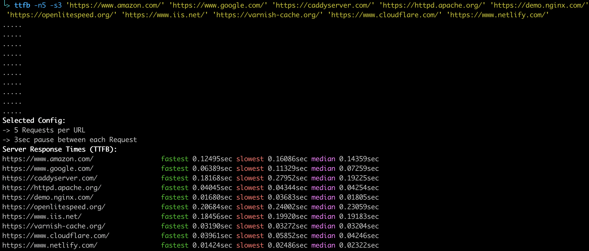

# Introduction

Measures [time-to-first-byte](https://en.wikipedia.org/wiki/Time_to_first_byte) for single or multiple URLs. Can show you quickest, slowest & median TTFB values plus optionally log all response headers.




# Usage

```
Usage: ttfb [options] url [url...]
	-d debug
	-l <log file> (infers -d) log response headers. Defaults to ./curl.log
	-n <number> of times to test time to first byte (default:1)
	-s <number> of seconds to sleep between each request to the same url (default:4, disabled:0)
	-v verbose output. Show response breakdown (DNS lookup, TLS handshake etc)
```

Implicitly follows a redirection chain using curl's `-L` option.

Can log all response headers (the default log file is `./curl.log`) by calling with `-d`.

Override the default log file by specifying `-l /some/file`.

Get quickest, slowest and median TTFB values by specifying the number of times to call a URL; use `-n2` for 2 tests, `-n5` for 5 and so on.

Uses the calculation `%{time_starttransfer¹} - %{time_appconnect²}` which doesn't include any connection overhead, to better approximate [devtool’s TTFB figure](https://developers.google.com/web/tools/chrome-devtools/network/understanding-resource-timing#slow_time_to_first_byte).

¹ [`time_starttransfer`](https://github.com/curl/curl/blob/e431daf013ea04cb1a988a2009d820224ef5fb79/docs/cmdline-opts/write-out.d#L141-L144)
> The time, in seconds, it took from the start until the first byte was just about to be transferred. This includes time_pretransfer and also the time the server needed to calculate the result.</blockquote>

² [`time_appconnect`](https://github.com/curl/curl/blob/e431daf013ea04cb1a988a2009d820224ef5fb79/docs/cmdline-opts/write-out.d#L118-L120)
>The time, in seconds, it took from the start until the SSL/SSH/etc
connect/handshake to the remote host was completed.

# Examples

Basic usage:

```
$ ttfb example.com
0.227436sec
```

A simplified data format is returned, 
when stdout doesn't directly go to a tty:

```
$ ttfb example.com | cat
0.227436
```

Basic usage with verbose response breakdown:

```
$ ttfb -v https://example.com
DNS lookup: 0.005152 TLS handshake: 0.000000 TTFB including connection: 0.200831 TTFB: 0.200831 Total time: 0.201132
```

Test multiple times:

```
$ ttfb -n 5 example.com/example/url
.....
fastest 0.177263sec slowest 0.214302sec median 0.179957sec
```

Test multiple URLs:

```
$ ttfb bbc.co.uk news.bbc.co.uk
bbc.co.uk        0.049985sec
news.bbc.co.uk   0.054122sec
```

Test multiple URLs, multiple times:

```
$ ttfb -n 5 bbc.co.uk news.bbc.co.uk
.....
.....
bbc.co.uk       fastest 0.030936sec slowest 0.057755sec median 0.034663sec
news.bbc.co.uk  fastest 0.031413sec slowest 0.182791sec median 0.035001sec
```

Test multiple URLs, multiple times - but turn off sleep between requests:

```
$ ttfb -n 5 -s 0 bbc.co.uk news.bbc.co.uk
.....
.....
bbc.co.uk       fastest 0.030936sec slowest 0.057755sec median 0.034663sec
news.bbc.co.uk  fastest 0.031413sec slowest 0.182791sec median 0.035001sec
```

Verbose response breakdown when multiple tests specified:

```
$ ttfb -v -n 5 bbc.co.uk
DNS lookup: 0.005335 TLS handshake: 0.102314 TTFB including connection: 0.148328 TTFB: 0.046014 Total time: 0.646115
DNS lookup: 0.005322 TLS handshake: 0.102609 TTFB including connection: 0.150693 TTFB: 0.048084 Total time: 0.644611
DNS lookup: 0.004277 TLS handshake: 0.102066 TTFB including connection: 0.172199 TTFB: 0.070133 Total time: 1.196256
DNS lookup: 0.004444 TLS handshake: 0.107375 TTFB including connection: 0.160771 TTFB: 0.053396 Total time: 0.637290
DNS lookup: 0.005352 TLS handshake: 0.118882 TTFB including connection: 0.168772 TTFB: 0.049890 Total time: 0.653761

fastest 0.046014sec slowest 0.070133sec median 0.049890sec
```

Log all the response headers for multiple tests to multiple URLs:

```
ttfb -d -n 2 bbc.co.uk https://www.bbc.co.uk/weather
..
..
bbc.co.uk                      fastest 0.027550sec slowest 0.055215sec median 0.041382sec
https://www.bbc.co.uk/weather  fastest 0.101020sec slowest 0.297923sec median 0.199471sec

$ ls *.log
bbc_co_uk-curl.log                     https___www_bbc_co_uk_weather-curl.log

$ cat https___www_bbc_co_uk_weather-curl.log
HTTP/2 200
server: openresty
x-cache-action: MISS
vary: Accept-Encoding,X-BBC-Edge-Cache,X-BBC-Edge-Scheme,X-CDN
x-cache-age: 0
cache-control: private, stale-while-revalidate=10, max-age=0, must-revalidate
content-type: text/html;charset=utf-8
x-mrid: w1
date: Thu, 11 Apr 2019 17:08:07 GMT
x-xss-protection: 1; mode=block
x-content-type-options: nosniff
x-lb-nocache: true
x-msig: 24e37f81323984e4e45b8048f9e3c94a
x-frame-options: SAMEORIGIN
content-length: 1077454

HTTP/2 200
server: openresty
x-cache-action: MISS
vary: Accept-Encoding,X-BBC-Edge-Cache,X-BBC-Edge-Scheme,X-CDN
x-cache-age: 0
cache-control: private, stale-while-revalidate=10, max-age=0, must-revalidate
content-type: text/html;charset=utf-8
x-mrid: w1
date: Thu, 11 Apr 2019 17:08:08 GMT
x-xss-protection: 1; mode=block
x-content-type-options: nosniff
x-lb-nocache: true
x-msig: 24e37f81323984e4e45b8048f9e3c94a
x-frame-options: SAMEORIGIN
content-length: 1077454
```

# More detail on time-to-first-byte

See https://blog.cloudflare.com/a-question-of-timing/
and https://curl.haxx.se/docs/manpage.html for an explanation
of how the curl variables relate to the various stages of
the transfer.


To get a better approximation of devtool's TTFB, we consider
the time without the connection overhead:
`%{time_starttransfer} - %{time_appconnect}`

Uses a dirty `eval` to do the ttfb arithmetic. Depends
on `awk`, `bc`, `column` and `curl` commands.


# Genesis

Based on a [gist](https://gist.github.com/sandeepraju/1f5fbdbdd89551ba7925abe2645f92b5)
by https://github.com/sandeepraju

Modified by [jay@gooby.org](https://github.com/jaygooby), [@jaygooby](https://twitter.com/jaygooby)

Modified by [d.abromeit@koch-essen.de](https://github.com/Abromeit), [@der_abro](https://twitter.com/der_abro)
